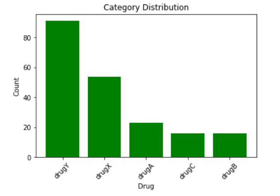
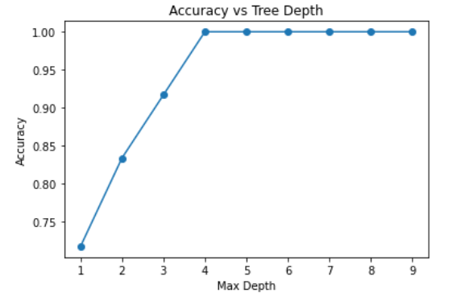
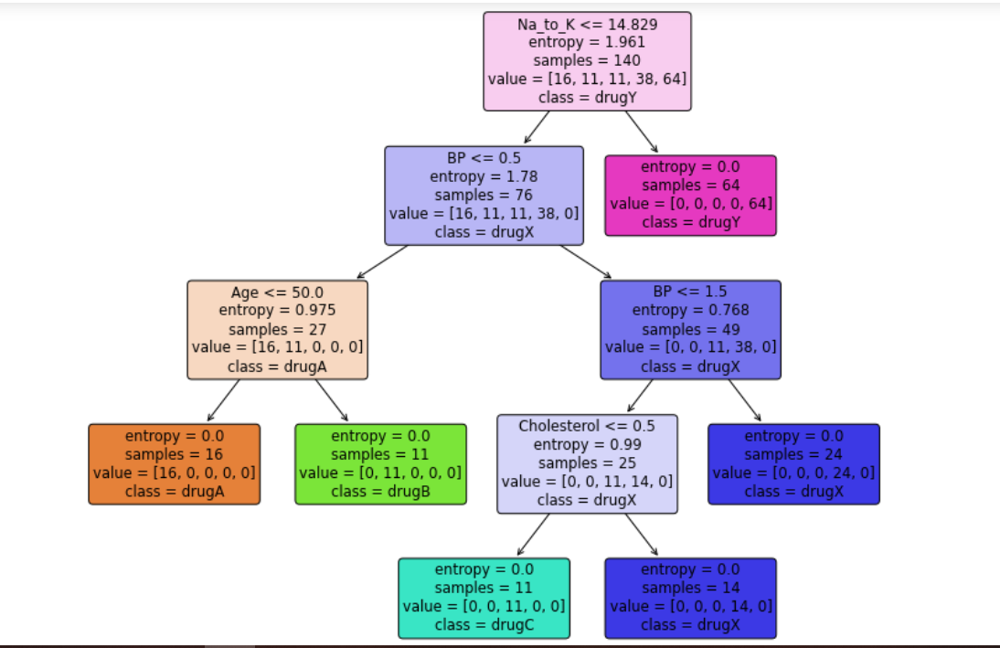
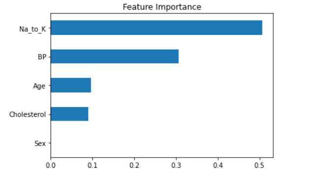
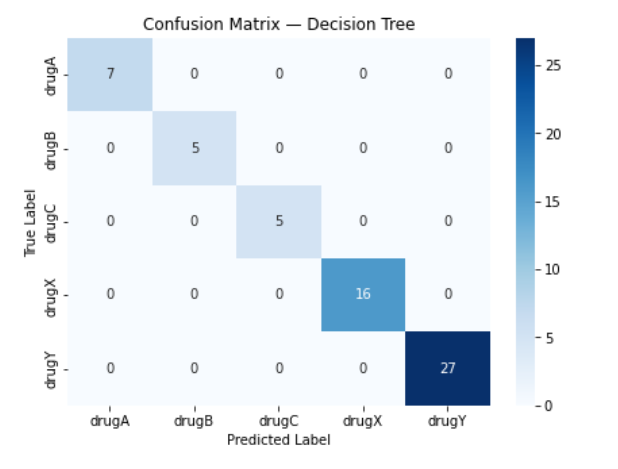

# Drug Classification using Decision Tree

A machine learning project that predicts the most suitable drug for a patient
based on their medical profile, using a Decision Tree classifier trained on
the drug200 dataset.

## About the Dataset

The dataset contains records of 200 patients who all suffered from the same
illness. Each patient responded to one of five medications:
Drug A, Drug B, Drug C, Drug X, or Drug Y.

| Feature | Description |
|---------|-------------|
| Age | Patient age |
| Sex | Male / Female |
| BP | Blood Pressure (High / Low / Normal) |
| Cholesterol | High / Normal |
| Na_to_K | Sodium-to-Potassium ratio in blood |
| Drug | Target — drug the patient responded to |

<!--  -->

 
 

## What's Inside the Notebook

- Data loading and exploration
- Label encoding for categorical features
- Correlation analysis between features and target
- Train/test split with stratification
- Max depth tuning with accuracy vs depth plot
- Decision Tree training (entropy criterion, max_depth=4)
- Confusion matrix and classification report
- Gini vs Entropy comparison using cross-validation
- Feature importance visualization
- New patient drug prediction

## Results

| Metric | Value |
|--------|-------|
| Test Accuracy | 98.33% |
| CV Accuracy | 98.50% ± 3.00% |
| Most Important Feature | Na_to_K |
| Key Decision Rule | Na_to_K > 14.627 → Drug Y |

## Key Finding

The sodium-to-potassium ratio (`Na_to_K`) is by far the most important
feature. A value above 14.627 alone is enough to predict Drug Y, regardless
of any other patient attributes.

## Technologies Used

- Python
- Pandas & NumPy
- Scikit-learn
- Matplotlib & Seaborn
- Jupyter Notebook

## How to Run

1. Clone the repo
   git clone https://github.com/ShahidAbas/drug-classification-decision-tree.git

2. Install dependencies
   pip install pandas numpy scikit-learn matplotlib seaborn jupyter

3. Launch the notebook
   jupyter notebook Decision_Tree.ipynb
